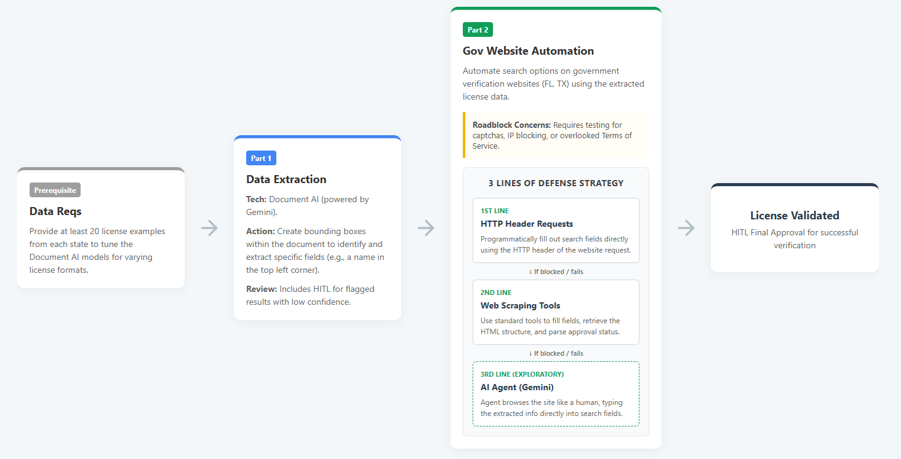

# TABC License Verification — Web Search Automation

Automated verification of Texas alcohol licenses against the [TABC Public Search](https://tabcaims.elicense365.com/Apps/LicenceSimpleSearch/#) website, implementing a **3 Lines of Defense** strategy.

## Architecture

This project implements Part 2 of the License Solution Architecture. It receives extracted license data (from Document AI in Part 1) and verifies it against the TABC government website.



### Defense Lines

| Line | Method | Tech | When to Use |
|------|--------|------|-------------|
| **1st** | HTTP Header Requests | `requests` / `httpx` | Default — fastest, lowest overhead. Directly POST to the TABC search endpoint (`/Apps/RequesforaValidation`) with form data. |
| **2nd** | Web Scraping / Browser Automation | `playwright` | Fallback if 1st line is blocked (captcha, session tokens, JS-rendered content). Fills fields and parses the DOM. |
| **3rd** | AI Agent (Computer Use) | `google-adk` + `gemini-2.5-computer-use` | Last resort / exploratory. Gemini visually browses the TABC site like a human, typing into fields and reading results from screenshots. |

## Project Structure

```
websearch_automation/
├── README.md
├── requirements.txt
├── server.py                      # FastAPI entry point (uvicorn server:app)
├── .env                           # GCP project config (same as product-fidelity-eval)
├── backend/
│   ├── main.py                    # (legacy — use server.py at root instead)
│   ├── config.py                  # Configuration & constants
│   ├── models.py                  # Pydantic models
│   ├── defense_line_1_http.py     # Direct HTTP requests to TABC
│   ├── defense_line_2_scraper.py  # Playwright browser automation
│   ├── defense_line_3_agent.py    # Gemini Computer Use agent (ADK)
│   └── playwright_computer.py     # Browser interface for ADK ComputerUseToolset
├── app/
│   ├── index.html
│   ├── package.json
│   ├── vite.config.ts
│   ├── tsconfig.json
│   ├── tailwind.config.ts
│   ├── postcss.config.cjs
│   └── src/
│       ├── main.tsx
│       ├── index.css
│       ├── App.tsx
│       ├── components/
│       │   ├── Header.tsx          # Mode toggle (Single File / Batch)
│       │   ├── SingleFilePanel.tsx  # Upload + visual defense cascade flow
│       │   ├── BatchList.tsx       # Checkbox list for batch selection
│       │   └── ResultsPanel.tsx    # Verification results display
│       └── services/
│           └── apiClient.ts        # API calls to FastAPI backend
└── imgs/
```

## App Modes

### Single File Mode
- Upload a license PDF/image and select the state (TX, FL)
- Visual progress flow showing the 3 Lines of Defense cascade (Lines 1 & 2 are scripts, Line 3 is the Gemini browser agent)
- Each step shows live status: idle → running → success/failed/skipped
- Final structured JSON output with copy-to-clipboard
- No chat — just upload, process, results

### Batch Mode
- Paste a list of license numbers (one per line or comma-separated)
- Checkbox list to select which licenses to verify
- Select All / Deselect All / Remove controls
- Real-time SSE progress streaming per license
- Cancel button for in-progress batches

## Setup

Uses the same GCP project and service account as [product-fidelity-eval](https://github.com/behardja/product-fidelity-eval/tree/expand_video_feature).

### Prerequisites

- Python 3.10+
- Node.js v18+
- Google Cloud authentication (e.g. `gcloud auth application-default login`)
- Vertex AI API enabled
- Same service account / permissions as product-fidelity-eval

### Environment

Copy the `.env` file and fill in your project ID:

```bash
cd websearch_automation
cp .env.example .env
# Edit .env with your project ID
```

Or export directly:

```bash
export GOOGLE_CLOUD_PROJECT="your-project-id"
export GOOGLE_GENAI_USE_VERTEXAI=1
```

### Install Dependencies

```bash
# Python
pip install -r requirements.txt
playwright install chromium
playwright install-deps chromium

# Frontend
cd app
npm install
```

### Running the App

**1. Start the backend server (terminal 1):**

```bash
uvicorn server:app --host 0.0.0.0 --port 8000 --reload
```

**2. Start the frontend dev server (terminal 2):**

```bash
cd app
npm run dev   # alt: npx vite --host 0.0.0.0
```

The app opens at [http://localhost:3000](http://localhost:3000).

## Quick Test (CLI)

```bash
# 1st Line — direct HTTP
python -m backend.defense_line_1_http --license 200034858

# 2nd Line — Playwright scraper
python -m backend.defense_line_2_scraper --license 200034858

# 3rd Line — Gemini Computer Use agent
python -m backend.defense_line_3_agent --license 200034858
```

## 3rd Line: ADK Computer Use Agent

The 3rd line of defense uses Google's [ADK Computer Use sample](https://github.com/google/adk-python/tree/main/contributing/samples/computer_use) as a foundation. It leverages:

- **Model**: `gemini-2.5-computer-use-preview-10-2025`
- **Tools**: `ComputerUseToolset` from `google.adk`
- **Browser**: Playwright-controlled Chromium
- **Approach**: The agent sees screenshots of the TABC website, types the license number into the search field, clicks search, and reads the results visually — exactly like a human would.

This is the most resilient approach (works even if the site structure changes) but also the slowest and most expensive. Use only when Lines 1 and 2 fail.
